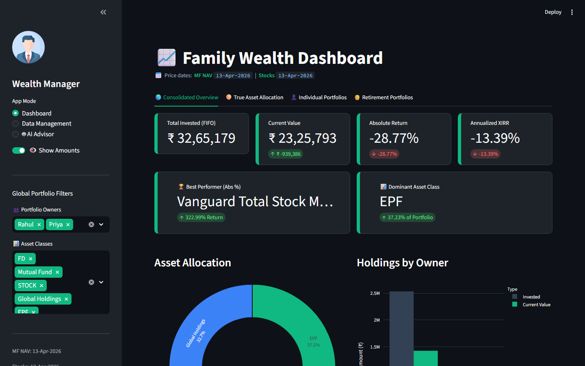
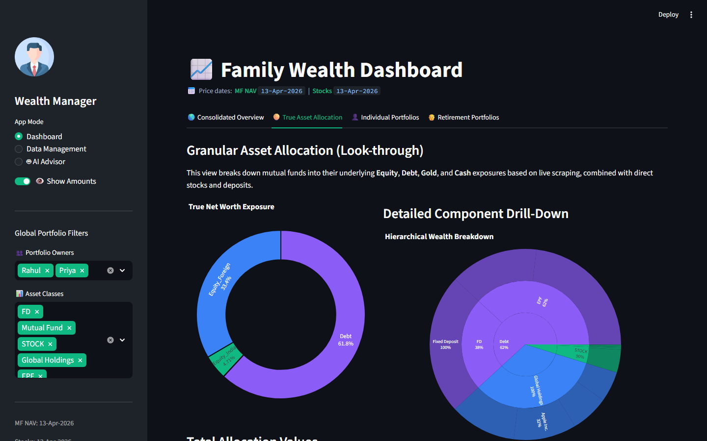
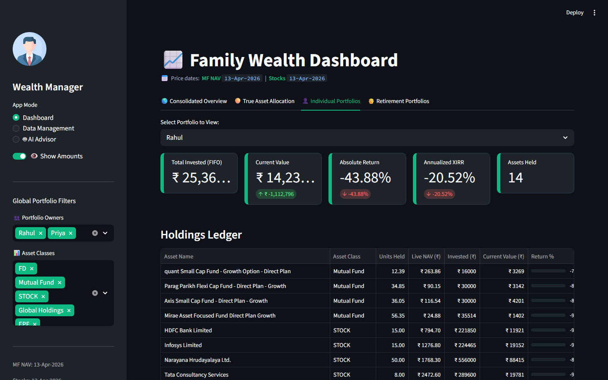
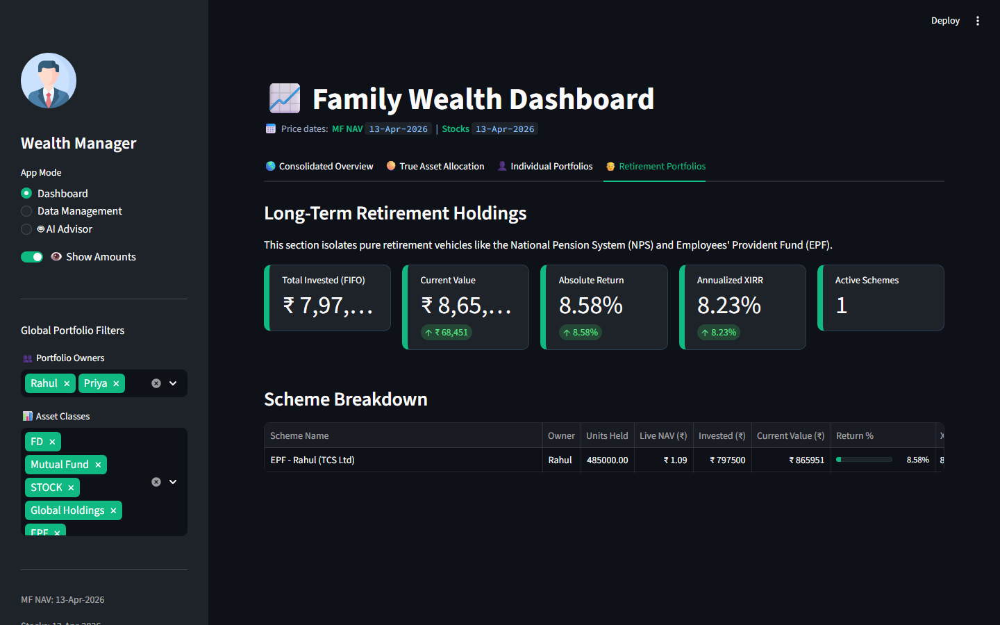
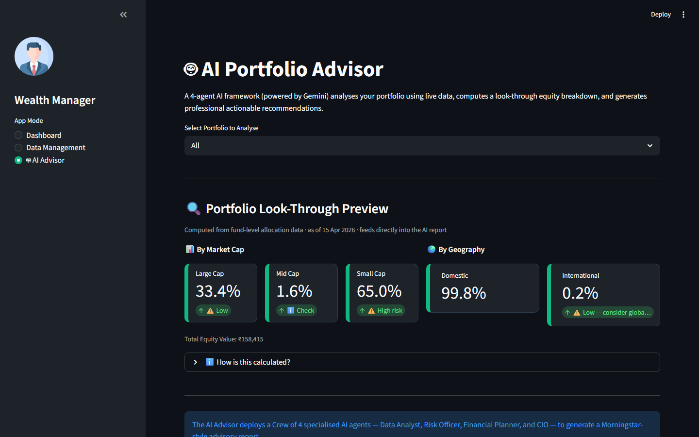
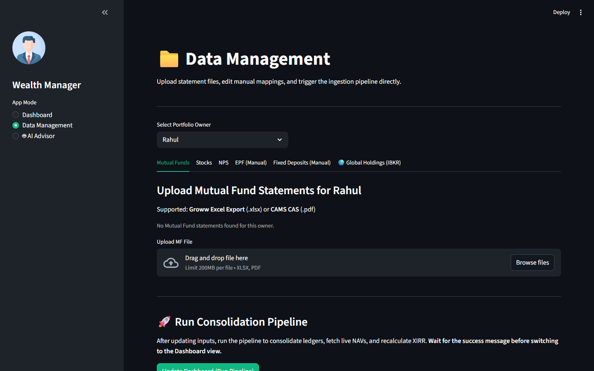

# 📊 Family Wealth Consolidator

> An end-to-end Python platform that ingests scattered family investment statements, fetches live market prices, computes portfolio analytics (XIRR, CAGR, Sharpe ratio, asset allocation), and surfaces everything through an interactive Streamlit dashboard — topped off with a multi-agent AI portfolio advisor powered by Gemini.



---

## 🎯 The Problem
Prior to this project, there was no single **consolidated view** of the family portfolio that catered to all the different types of asset classes (Mutual Funds, Stocks, NPS, EPF, FDs, Global Holdings). There was a lack of **flexibility** to look at different layers of the portfolio (e.g., individual owner views vs. consolidated family view, or surface-level asset classes vs. true market-cap look-through). Most importantly, **genuine and deep analysis** of the family's wealth and performance was missing.

## 💡 The Approach
To solve this, this end-to-end Python platform was built. It automatically ingests scattered investment statements from various brokers and platforms, fetches live market prices via APIs, and computes robust portfolio analytics like XIRR (using FIFO cost basis), CAGR, Sharpe ratios, and true asset allocation. Everything is surfaced through an interactive Streamlit dashboard, topped off with a multi-agent AI portfolio advisor that provides actionable insights.

## 🛠️ Key Technical Decisions

| Decision | Rationale |
|---|---|
| **`uv` as package manager** | Deterministic installs, fast, no venv activation required. Always prefix with `uv run`. |
| **CSV as the data layer** | No ORM or database. Keeps the project portable, auditable, and inspectable in Excel. |
| **Stop-on-failure pipeline** | `run_all.py` exits immediately if any step fails — prevents stale/partial data from reaching the dashboard. |
| **Centralised logging** | All modules use `logging.getLogger(__name__)`. Configure once via `LOG_LEVEL` env var. |
| **FIFO cost basis** | Matches Indian tax law for capital gains calculation. |
| **XIRR over simple CAGR** | Handles irregular cash flows (SIP, lump sum, partial redemptions) correctly. |
| **Ruff** | Linting + formatting at 100-char line length targeting Python 3.11+. |

## 🚀 What We'd Build Next (Backlog)

- **Broker lock-in:** Support for standard CDSL/NSDL CAS statements beyond just Groww and CAMS.
- **NPS API Enhancements:** While NAVs are fetched live from npsnav.in, we still require the KFintech PDF for historical unit counts. A direct transaction API would be better.
- **EPF interest API:** Fetch EPF interest rates live from EPFO instead of relying on the manual `epf_config.csv`.
- **Scheduled refresh:** A cron or cloud scheduler integration so the pipeline runs automatically daily without manual triggers.

For the full technical backlog, see [`DEVELOPER.md`](DEVELOPER.md).

---

## ✨ What It Does

| Capability | Detail |
|---|---|
| **Multi-source ingestion** | CAMS CAS PDF, Groww CSV/XLSX exports, NPS KFintech PDF, manual EPF & FD configs |
| **Live pricing** | MF NAVs via AMFI, stock prices via yfinance, NPS NAVs via npsnav.in API |
| **Performance analytics** | XIRR (FIFO cost basis), CAGR, absolute returns, Sharpe ratio, Alpha vs benchmark |
| **Look-through allocation** | Scrapes Moneycontrol to decompose each fund into Market Cap (Large/Mid/Small) and Geography (Domestic/Intl) alongside Asset Class (Equity/Debt/Gold/Cash) |
| **Interactive dashboard** | Streamlit UI with portfolio overview, per-owner drilldowns, charts, and PDF export |
| **AI Advisor** | CrewAI multi-agent pipeline (Data Analyst → Risk Officer → CIO) using Gemini LLM |
| **Privacy mode** | A single toggle hides all amounts - safe to share your screen |

---

## 🖼️ Dashboard Walkthrough

### Consolidated Overview
The main landing tab shows executive KPI cards, an asset allocation donut chart, and a holdings-by-owner bar chart — all driven by live market prices.


**Key metrics visible at a glance:**
- **Total Invested (FIFO)** — cost basis using First-In-First-Out accounting
- **Current Value** — live market value
- **Absolute Return %** — total gain/loss as a percentage
- **Annualized XIRR** — time-weighted return accounting for exact cash flow dates
- **Best Performer** — top asset by absolute return %
- **Dominant Asset Class** — largest allocation by current value

---

### Holdings Table
All active holdings are shown in a sortable table with units, live NAV, current value, and portfolio weight — including a visual progress bar per asset.


---

### True Asset Allocation (Look-Through)
This tab goes beyond surface-level categories. It scrapes live fund fact-sheets to decompose each mutual fund into its underlying **Equity (India)**, **Equity (Foreign)**, **Debt**, **Gold**, and **Cash** components — giving you the *real* exposure of your portfolio.

The sunburst chart on the right lets you drill down from asset class → instrument type → individual holding in a single interactive view.



---

### Individual Portfolios
Drill into any single owner's portfolio with their personal XIRR, invested amount, and a per-asset breakdown showing live NAV, return %, and value date.



---

### Retirement Portfolios
Isolates NPS and EPF holdings into a dedicated view — retirement-specific metrics with scheme-level breakdown.



---

### AI Advisor
A Gemini-powered 4-agent CrewAI pipeline that reads your pre-computed portfolio data and generates a Morningstar-style advisory report with Indian market context (ELSS, NPS, SGBs, taxation).



---

### Data Management
Upload new statement files, trigger the pipeline, and refresh the dashboard — all from the browser without touching the terminal.



---

## 🗂️ Project Structure

```
Portfolio_Consolidator/
│
├── run_all.py              ← Pipeline orchestrator (runs all steps in order)
│
├── ingestion/              ← Step 1: Parse raw statements → master_ledger.csv
│   ├── ingest_mf.py        — CAMS PDF + Groww XLSX → MF cash flows
│   ├── ingest_stocks.py    — Groww XLSX → stock holdings
│   ├── ingest_nps.py       — KFintech PDF → NPS units & cash flows
│   ├── ingest_epf.py       — Manual epf_config.csv → EPF accrual rows
│   ├── ingest_fd.py        — Manual FD Excel → fixed deposit rows
│   └── ingest_global.py    — Manual CSV → global/IBKR holdings
│
├── valuation/              ← Step 2: Fetch live prices → master_valuation.csv
│   ├── fetch_nps_navs.py   — Cache latest NPS NAVs from npsnav.in
│   ├── valuate_mf_nps.py   — Live MF & NPS NAV from AMFI API
│   ├── valuate_stocks.py   — Live prices from yfinance (.NS tickers)
│   ├── valuate_epf.py      — Accrual-based EPF current value
│   └── valuate_fd.py       — Accrual-based FD current value
│
├── analytics/              ← Step 3–5: Derive metrics
│   ├── calculate_xirr.py   — FIFO + XIRR → performance_metrics.csv
│   ├── calc_allocations.py — Asset class allocation → asset_allocation.csv
│   ├── compute_equity_lookthrough.py — True market-cap & geographic exposure
│   ├── benchmark.py        — Cache Nifty 50 history → nifty50_history.csv
│   ├── fetch_allocations.py — Scrape and cache fund allocation maps
│   ├── mf_data_fetcher.py  — Fetch CAGR, NAV history, fund metadata
│   └── peer_returns_engine.py — Compute Sharpe, Alpha, Beta vs peers
│
├── dashboard/              ← Streamlit web UI
│   ├── app.py              — Main entrypoint (all tabs, charts, metrics)
│   ├── ui_data_management.py — "Data Management" tab (upload, run pipeline)
│   └── export_pdf.py       — Generate downloadable PDF report via FPDF2
│
├── ai_advisor/             ← AI portfolio advisory engine
│   ├── advisor.py          — CrewAI crew: Analyst → Risk Officer → CIO
│   ├── ai_tools.py         — CrewAI @tool wrappers (holdings, allocation, fundamentals)
│   └── ui.py               — Streamlit UI component for the AI Advisor tab
│
├── core/                   ← Shared utilities
│   └── logging_config.py   — Centralised logging setup (LOG_LEVEL env var)
│
├── sample_data/            ← Anonymised dummy data for testing (safe to commit)
│   ├── mf/Rahul_MF.xlsx    — Sample Groww MF export (dummy transactions)
│   ├── stock/Rahul_stocks.xlsx — Sample Groww stock orders
│   ├── EPF/epf_config.csv  — Sample EPF config (two dummy members)
│   ├── FD/FD_details.xlsx  — Sample FD details (3 dummy deposits)
│   ├── global/global_transactions.csv — Sample IBKR/global trades
│   ├── _generate_xlsx.py   — Script to regenerate the sample xlsx files
│   └── README.md           — Format reference for every file type
│
├── data/
│   ├── input/              ← Drop YOUR statements here (git-ignored)
│   │   ├── mf/             — CAMS CAS PDFs + Groww MF XLSX
│   │   ├── stock/          — Groww stock order XLSX
│   │   ├── NPS/            — KFintech NPS PDFs
│   │   ├── EPF/            — epf_config.csv
│   │   ├── FD/             — fd_config.xlsx
│   │   └── global/         — global_transactions.csv
│   └── output/             ← Generated CSVs (source of truth for dashboard, git-ignored)
│       ├── master_ledger.csv         — All historical transactions
│       ├── master_valuation.csv      — Current valuations with live prices
│       ├── performance_metrics.csv   — XIRR, returns per asset
│       ├── asset_allocation.csv      — Equity/Debt/Gold/Cash breakdown
│       ├── equity_lookthrough.csv    — Large/Mid/Small and Domestic/International
│       ├── nifty50_history.csv       — Benchmark data cache
│       └── pipeline.log              — Full run log
│
├── tests/                  ← 19 test files, 75%+ coverage gate
│   ├── conftest.py         — Shared fixtures and sample DataFrames
│   └── test_*.py           — One test file per module
│
├── docs/screenshots/       ← Dashboard screenshots (used in this README)
├── .env                    ← Secrets (never committed)
├── .env.example            ← Template for required env vars
├── pyproject.toml          ← Dependencies, ruff, coverage config
└── DEVELOPER.md            ← Technical deep-dive & backlog
```

---

## 🔄 How It All Fits Together

The project flows through **four distinct layers**:

```
Raw Files (PDFs / CSVs / XLSXs)
        │
        ▼
[ ingestion/ ]  →  data/output/master_ledger.csv
        │               (all historical transactions, one row per transaction)
        ▼
[ valuation/ ]  →  data/output/master_valuation.csv
        │               (each asset with live NAV × units = current value)
        ▼
[ analytics/ ]  →  performance_metrics.csv, asset_allocation.csv, equity_lookthrough.csv
        │               (XIRR, CAGR, Sharpe, true look-through allocation & cap-size splits)
        ▼
[ dashboard/ ]  →  Streamlit UI  (reads the CSVs above)
        │
        └──  [ ai_advisor/ ]  →  LLM-generated advisory report
```

**`run_all.py`** is the glue — it runs all 13 pipeline modules in dependency order. If any step fails, it halts immediately so no stale data ever reaches the dashboard.

---

## 🚀 Quick Start

### 1. Prerequisites

- Python 3.11+
- [`uv`](https://docs.astral.sh/uv/) package manager

```bash
# Install uv (if not already)
pip install uv
```

### 2. Clone & install dependencies

```bash
git clone https://github.com/your-username/Portfolio_Consolidator.git
cd Portfolio_Consolidator
uv sync
```

### 3. Configure environment

```bash
cp .env.example .env
```

Open `.env` and fill in your values:

```env
CAMS_PASSWORD=your_cams_pdf_password
NPS_PASSWORD=your_nps_pdf_password
GEMINI_API_KEY=your_gemini_api_key
GEMINI_MODEL=gemini-2.0-flash
```

### 4. Try with sample data first

Before adding your own statements, you can verify the full pipeline works with the included anonymised sample data:

```bash
uv run python test_with_sample_data.py
```

To load sample data into the dashboard for a live preview:

```bash
uv run python test_with_sample_data.py --keep-output
uv run streamlit run dashboard/app.py
```

> When done previewing, run `uv run python run_all.py` to process your real data and restore the dashboard.

### 5. Add your real statements

Place files in the appropriate `data/input/` subfolder. The owner name is derived automatically from the **filename** — e.g., `Priya_MF.xlsx` → owner `Priya`.

| Asset Type | Source | Format | Folder |
|---|---|---|---|
| Mutual Funds | CAMS CAS Statement | Encrypted PDF | `data/input/mf/` |
| Mutual Funds | Groww MF Export | `.xlsx` (11-row preamble) | `data/input/mf/` |
| Stocks / ETFs | Groww Stock Orders Export | `.xlsx` (5-row preamble) | `data/input/stock/` |
| NPS | KFintech / Protean PDF | Encrypted PDF | `data/input/NPS/` |
| EPF | Manual config | `epf_config.csv` | `data/input/EPF/` |
| Fixed Deposits | Manual config | `FD_details.xlsx` | `data/input/FD/` |
| Global Holdings (IBKR) | Manual CSV | `global_transactions.csv` | `data/input/global/` |

> **Owner name discovery:** Every ingestion script derives the owner name from the filename stem. `Pankaj_MF.xlsx` → owner `Pankaj`. The first `_`-separated token is used — name your files consistently.

### 6. Run the full pipeline

```bash
uv run python run_all.py
```

For verbose debug output:

```bash
LOG_LEVEL=DEBUG uv run python run_all.py
```

### 7. Launch the dashboard

```bash
uv run streamlit run dashboard/app.py
```

Opens at **http://localhost:8501**. The dashboard also has a built-in **"Data Management"** tab where you can upload files and trigger the pipeline without touching the terminal.

---

## 📥 Input File Formats

See [`sample_data/README.md`](sample_data/README.md) for exact column layouts, and the files in [`sample_data/`](sample_data/) as working examples you can copy and fill in.

### EPF Config (`epf_config.csv`)

```csv
Member Name,Employee Monthly Contribution,Employer Monthly Contribution,Current Balance,Annual Interest Rate,Last Updated
Rahul,1800,1800,285000,8.25,2024-03-31
```

### FD Details (`FD_details.xlsx`)

| Column | Example |
|---|---|
| Owner | Rahul |
| Bank Name | HDFC Bank |
| FD Amount | 100000 |
| Interest Rate (%) | 7.1 |
| FD Start Date | 15-03-2023 |
| Maturity Date | 15-03-2025 |

### Global Holdings (`global_transactions.csv`)

```csv
Portfolio Owner,Ticker,Transaction Type,Shares,Price (INR),Date
Rahul,VTI,BUY,5,7450,10-Feb-2024
```

### Groww Mutual Fund Export (`.xlsx`)

The first 11 rows are a Groww preamble — the pipeline skips them automatically. Row 12 must contain headers:
`Scheme Name, AMFI, Date, Transaction Type, Amount, Units, NAV, Status`

---

## 📤 Output Files

All generated files land in `data/output/`. The dashboard reads these directly at startup.

| File | Contents |
|---|---|
| `master_ledger.csv` | Every transaction: buy, sell, interest credit, employer contribution |
| `master_valuation.csv` | Current snapshot: units × live NAV = current value per asset |
| `performance_metrics.csv` | XIRR, invested amount, returns, CAGR per asset and per owner |
| `asset_allocation.csv` | Top-level Equity/Debt/Gold/Cash split for each owner |
| `asset_allocation_drilldown.csv` | Granular sub-class look-through (e.g., Large Cap Equity, Gilt Debt) |
| `equity_lookthrough.csv` | Large/Mid/Small cap and Domestic/International split |
| `nifty50_history.csv` | Nifty 50 price history for benchmark comparison |
| `nps_latest_navs.json` | Cached NPS scheme NAVs from npsnav.in |
| `ai_portfolio_summary.csv` | Unified flat file for AI analysis (cost basis, live NAV, XIRR per ticker) |
| `pipeline.log` | Full structured log of the last pipeline run |

---

## 🤖 AI Advisor

The AI Advisor is a **4-agent CrewAI pipeline** that reads pre-computed portfolio data (no hallucinations — only works with what the pipeline produced) and generates a Morningstar-style advisory with deep **Indian market context** (ELSS, NPS, Sovereign Gold Bonds, LTCG/STCG taxation).

```
Agent 1: Senior Financial Data Analyst
    → Fetches holdings, allocation, and stock fundamentals via structured JSON tools

Agent 2: Chief Risk Officer
    → Analyses concentration risk, volatility, and downside exposure

Agent 3: Certified Financial Planner
    → Maps portfolio against life-stage milestones (emergency fund, tax-saving, retirement)

Agent 4: Chief Investment Officer
    → Synthesises everything into a client-ready Markdown report
      with Hold / Buy / Sell recommendations
```

**To use:**
1. Set `GEMINI_API_KEY` and `GEMINI_MODEL` in `.env`
2. Open the **🤖 AI Advisor** tab in the dashboard
3. Select owners and click **Generate Report**

**Demo mode** (no real data needed):
```bash
uv run python ai_advisor/advisor.py --demo
```

**Caching:** Reports are cached by an MD5 hash of the underlying valuation data. Re-running with unchanged data returns instantly. Change detection is automatic.

---

## 🧪 Testing

```bash
# Run all tests
uv run pytest tests/

# With coverage report
uv run pytest tests/ --cov --cov-report=term-missing

# Single module
uv run pytest tests/test_calculate_xirr.py -v
```

- **19 test files**, one per module
- **75% minimum coverage** gate enforced via `pyproject.toml`
- All LLM / external API calls are mocked
- `tests/conftest.py` provides shared sample DataFrames and fixtures
- CI runs on every push via **GitHub Actions** (`.github/workflows/ci.yml`)

---

## ⚙️ Configuration & Environment Variables

| Variable | Required | Purpose |
|---|---|---|
| `CAMS_PASSWORD` | Yes (if using CAMS PDFs) | Password to decrypt CAMS CAS PDFs |
| `NPS_PASSWORD` | Yes (if using NPS PDFs) | Password to decrypt KFintech NPS PDFs |
| `GEMINI_API_KEY` | For AI Advisor | Google Gemini API key — get at [aistudio.google.com](https://aistudio.google.com/app/apikey) |
| `GEMINI_MODEL` | For AI Advisor | Model name (e.g., `gemini-2.0-flash`) |
| `LOG_LEVEL` | Optional | `DEBUG` / `INFO` / `WARNING` (default: `INFO`) |


---

## 🔒 Data Privacy & Security

- All personal statement files (`data/input/`) are **git-ignored** — they never leave your machine.
- The `.env` file containing passwords and API keys is **git-ignored**.
- The `data/output/` folder (generated CSVs with real values) is **git-ignored**.
- Only `sample_data/` with fictitious dummy data is committed to the repository.
- The dashboard has a **privacy toggle** ("👁️ Show Amounts") that hides all rupee values — safe to share your screen during meetings.


---

## 📄 License

Personal / family use. Not intended for redistribution.
